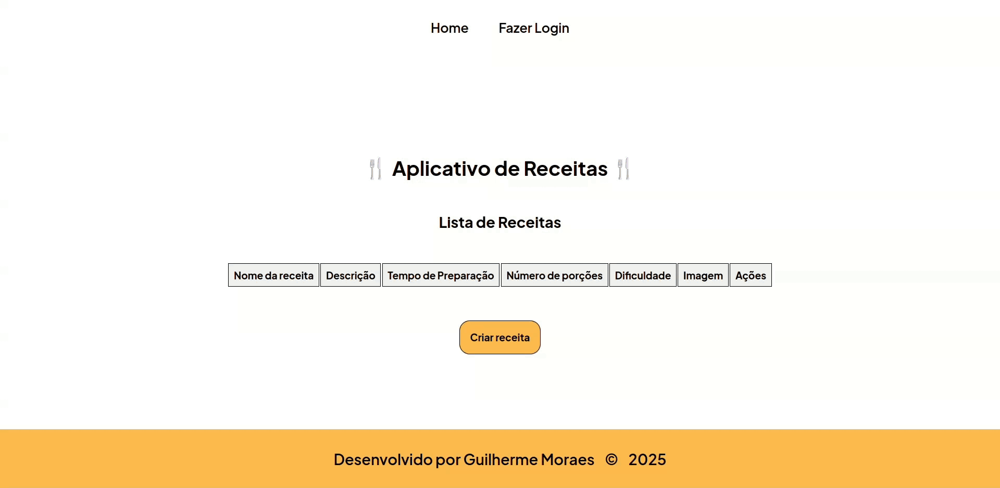
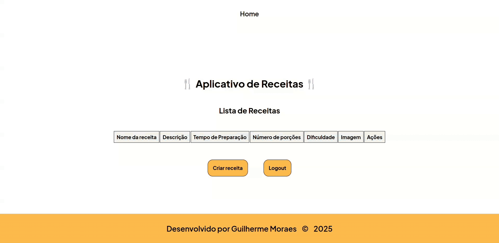
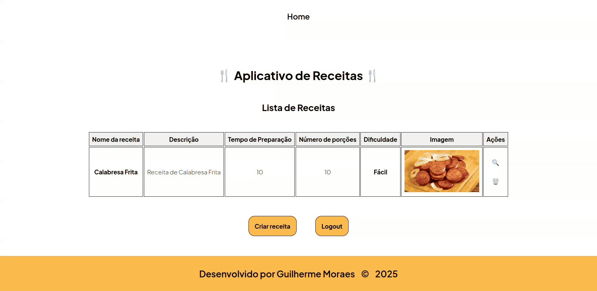

# 🍴 Aplicativo de Receitas - Projeto Fullstack

Aplicativo de Receitas criado com React no frontend e NestJS no backend.

## 🛠️ Tecnologias Utilizadas

- Front-end: React 19 + TypeScript + Vite
  - React Router (rotas)
  - TanStack Query (requisições e cache)
  - Zustand (estado de autenticação)
  - React Hook Form + Zod (formulários e validação)
- Back-end: NestJS (Node.js + TypeScript)
  - Drizzle ORM + migrations
  - Autenticação JWT
  - Swagger (documentação da API)
- Banco de dados: PostgreSQL
- Containerização: Docker + Docker Compose

## ✨ Funcionalidades

- Fazer login (Autenticação JWT)



> Ao rodar o back-end, um usuário padrão é criado. Ele é usado para fazer o login. Com o login sucedido, a JWT é guardada no localStorage e gerenciada por meio do store Zustand.

```bash
# Usuário criado
E-mail: admin@email.com
Senha: 123
```

- Registrar um novo usuário

- Criar uma nova receita



- Criar ingredientes e passos



- Deletar receita e fazer logout


## ⚙️ Instalação

### 1. Pré-requisitos

- Node.js 24
- pnpm
- Docker

### 2. Configurando o banco de dados (PostgreSQL)

Na pasta `backend/`, suba o banco de dados com Docker:

```bash
cd backend
docker compose up -d
cp .env.example .env
```

Isso sobe o PostgreSQL em `localhost:5432` (e um banco efêmero de testes em `localhost:5433`).

### 3. Configurando o back-end (NestJS)

Ainda na pasta `backend/`, instale as dependências e inicie o servidor:

```bash
pnpm install
pnpm start:dev
```

O back-end estará disponível em:

```
http://localhost:3000
```

No startup, a aplicação roda automaticamente as migrations (`drizzle/`) e o seed do usuário admin.

A documentação interativa da API (Swagger) fica em [`http://localhost:3000/docs`](http://localhost:3000/docs).

### 4. Configurando o front-end (React + Vite)

Em outro terminal, acesse a pasta `frontend/`:

```bash
cd frontend
cp .env.example .env
pnpm install
pnpm dev
```

O front-end estará disponível em:

```
http://localhost:5173
```

## 📁 Estrutura do projeto

```
├── backend/       # API REST (NestJS + Drizzle ORM + PostgreSQL)
├── frontend/      # SPA (React 19 + Vite)
├── old-backend/   # Backend original em Spring Boot (Java)
├── old-frontend/  # Frontend original em Angular
└── assets/        # GIFs de demonstração
```

## 👨‍💻 Autor

<table>
  <tr>
    <td align="center">
    <a href="https://github.com/guighm">
        <br />
        <sub><b>Guilherme Moraes</b></sub>
        </a>
    </td>
  </tr>
</table>